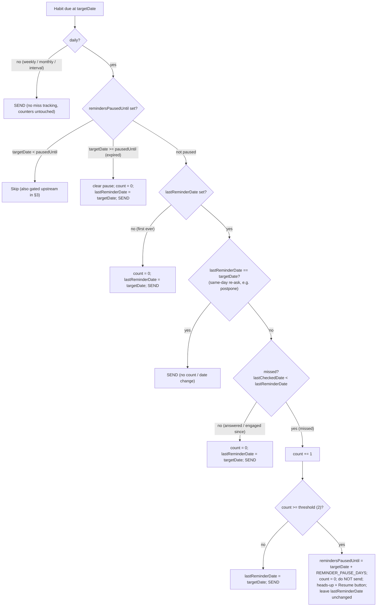

# Auto-pause reminders after 2 ignored in a row

## Behavior

- A "miss" = a scheduled reminder was sent and the user did not tap Yes/No/Skip for that reminder's `targetDate` before the next scheduled reminder.
- 2 consecutive misses → pause that habit's reminders for 7 days (`REMINDER_PAUSE_DAYS`), send one heads-up message with a "Resume now" button, then auto-resume.
- Any Yes/No/Skip response resets the miss counter and clears any pause.
- **Daily habits only.** Weekly/monthly/interval habits are never miss-tracked or paused (they fire too rarely to be a nag/block risk) — they always send unchanged. Eligibility is a single guard: `schedule.type === 'daily'` (§2).

Tie all logic to the reminder's `targetDate` (the same date stored in `callback_data` and written to `lastCheckedDate` on response), because that is the authoritative "answered day".

> **Engagement test uses `<`, not `!=`.** "Was the previous reminder answered?" is `lastCheckedDate >= lastReminderDate` (missed = `lastCheckedDate < lastReminderDate`). A plain `!=` would count a *more recent* proactive check (MiniApp / `/myhabits` on a non-reminder day) as a miss, because such a check advances `lastCheckedDate` past `lastReminderDate` without the reminder ever firing. `<` is immune to that. Keep the `lastReminderDate != targetDate` guard as well — it short-circuits same-`targetDate` re-asks (see the postpone interaction in §3a) so they never count as misses.



Every non-pause branch that sends **also sets `lastReminderDate = targetDate`** (the original diagram omitted this on the answered/reset branch, which would leave the marker stale and mis-evaluate the next occurrence). The first-ever occurrence (`lastReminderDate` unset) is never a miss.

## 1. Data model — [`src/domain/entities/Habit.ts`](src/domain/entities/Habit.ts)

Add optional fields to `Habit` (backward compatible; only ever written for **daily** habits):
- `missedReminderCount?: number` — consecutive unanswered reminders.
- `lastReminderDate?: string` — `YYYY-MM-DD` of the last reminder actually sent.
- `remindersPausedUntil?: string` — `YYYY-MM-DD`; reminders suppressed while `targetDate < remindersPausedUntil`.

Use a separate field (not `reminderEnabled`) so auto-pause never clobbers the user's manual enable/disable.

## 2. New use case — `src/domain/use-cases/EvaluateReminderPauseUseCase.ts`

Encapsulates the **pure decision** so both cron paths share it; **persistence is done by the caller after send** (see §4 and the ordering decision below). Constructor needs nothing (or `IHabitRepository` only for a convenience persist helper). Constants from env with defaults: `REMINDER_MISS_THRESHOLD` (2), `REMINDER_PAUSE_DAYS` (7). Only **daily** habits are eligible (see eligibility below).

Method `filterDueHabits(habits: Habit[], targetDate: string): { toSend: Array<{ habit: Habit; update: Partial<Habit> }>; pausedNow: Array<{ habit: Habit; update: Partial<Habit> }> }`:
- Returns decisions + the exact `Partial<Habit>` to persist; it does **not** call the repository. For each habit:
  - **Eligibility short-circuit:** if `!isAutoPauseEligible(habit.reminderSchedule)` (anything but daily) → `toSend` with `update = {}`. No miss tracking, no pause, counters untouched.
  - If `remindersPausedUntil` and `targetDate < remindersPausedUntil` → skip (defensive; the §3 gate normally filters these).
  - Resume if expired: `remindersPausedUntil` and `targetDate >= remindersPausedUntil` → `toSend` with `update = { remindersPausedUntil: undefined, missedReminderCount: 0, lastReminderDate: targetDate }` (fresh start, no miss counting on the resume occurrence).
  - **Same-day re-ask short-circuit:** if `lastReminderDate === targetDate` (already sent today — e.g. a "Check later" postpone re-firing, §3a) → `toSend` with `update = {}` (no counter/date change).
  - Else compute miss: `missed = !!lastReminderDate && lastReminderDate !== targetDate && lastCheckedDate < lastReminderDate`.
    - Note `<` (string compare on `YYYY-MM-DD`), **not** `!==`: a proactive check advances `lastCheckedDate` *past* `lastReminderDate`, which `!==` would wrongly read as a miss. Empty `lastCheckedDate === ''` sorts before any date, so a never-answered habit is correctly a miss.
    - If missed → `newCount = (missedReminderCount||0) + 1`; else `newCount = 0`.
    - If `newCount >= threshold` → `pausedNow` with `update = { remindersPausedUntil: addDays(targetDate, REMINDER_PAUSE_DAYS), missedReminderCount: 0 }` (do NOT send; leave `lastReminderDate` as-is).
    - Else → `toSend` with `update = { missedReminderCount: newCount, lastReminderDate: targetDate }`.

### Persist-vs-send ordering — DECIDED: evaluate purely, persist after a successful send

`filterDueHabits` performs no writes. The caller (§4) persists a **`toSend`** habit's `update` **only after its send resolves**, and a **`pausedNow`** habit's `update` **immediately** (not sending is the intent; the notice is best-effort). Rationale: a failed/undelivered reminder must be invisible to miss accounting — otherwise an infra hiccup manufactures phantom misses and can even pause a habit the user never got to ignore. This requires `sendHabitReminders` to report which habits actually went out (see §4); that change also fixes a pre-existing bug where one habit's send failure aborts the rest of the user's batch. Blocked users are still skipped upstream, so the residual case is only transient non-block failures — now handled correctly rather than mis-counted.

### Eligibility + pause duration — DECIDED: daily only, flat 7 days

Auto-pause targets the one **frequent, nag-prone** schedule: **daily**. Weekly, monthly, and interval reminders fire rarely enough that they aren't annoying, so they are **never miss-tracked and never paused** — they short-circuit straight to `toSend` with an empty `update` (their counter fields stay unset). One pure guard at the top of the per-habit logic:

```
isAutoPauseEligible(schedule) = schedule.type === 'daily'
```

Eligible (daily) habits pause for a flat `REMINDER_PAUSE_DAYS` (default 7): `remindersPausedUntil = addDays(targetDate, REMINDER_PAUSE_DAYS)` — a `YYYY-MM-DD` date, so the §3 gate and resume branch are unchanged. No per-schedule scaling.

A small exported pure helper `addDays(dateStr, n)` for the date math (mirroring the `YYYY-MM-DD` style in [`RecordHabitCheckUseCase`](src/domain/use-cases/RecordHabitCheckUseCase.ts)), plus the pure `isAutoPauseEligible(schedule)` guard.

## 3. Gate — [`src/domain/use-cases/GetHabitsDueForReminderUseCase.ts`](src/domain/use-cases/GetHabitsDueForReminderUseCase.ts)

In the per-habit loop (after the `disabled` and `lastCheckedDate === today` checks; the loop now also has the postpone-due branch added for "Check later", so add this **before** the due decision), add:
- `if (habit.remindersPausedUntil && today < habit.remindersPausedUntil) continue;`

This prevents paused habits from being considered each hour. When the pause expires, the habit reappears and step 2's resume branch clears the field.

> **`today` here ≠ `targetDate` in §2.** This gate's `today` comes from `GetHabitsDueForReminderUseCase`'s own `new Date(currentDate.toLocaleString('en-US', { timeZone }))` conversion, whereas §2/§4 use the cron's `Intl.DateTimeFormat('en-CA', …)` `targetDate`. The two can differ by a day at timezone/DST boundaries. It only affects the *pause-window boundary* (±1 day on a 7-day pause), so it's tolerable — but prefer computing the gate day the same way as `targetDate`, or at least keep this asymmetry in mind. Miss *counting* is unaffected because it lives entirely in `filterDueHabits` on `targetDate`.

## 3a. Interaction with "Check later" (postpone) — already shipped

The postpone feature (`Habit.postponedUntil`, `src/domain/utils/postpone.ts`, gotcha #11) makes a habit due **more than once per day**: the scheduled fire plus each postpone re-ask, all with the **same `targetDate`**. Two consequences the pause logic must respect:

- **A postpone re-ask must not count as a miss.** Handled by the same-day short-circuit in §2 (`lastReminderDate === targetDate` ⇒ re-send, no counter change). Without it, the `<` miss test would fire on every re-ask (`lastCheckedDate < lastReminderDate === targetDate`). This is load-bearing — cover it with a test (§7).
- **A paused habit silently drops any outstanding `postponedUntil`.** The §3 gate `continue`s before the postpone-due branch, so a pause wins over a pending postpone. That's the intended "paused = quiet" behavior; just be aware of it. (Resume/response clears the pause and a future reminder proceeds normally; the stale `postponedUntil` is harmless and gets cleared on the next send.)

Note: the `~line NNN` references in this doc predate the postpone change and have all shifted — locate by symbol, not line number.

## 4. Wire into both cron paths

In both `api/reminders.ts` and `src/api/reminders-server.ts` (locate the per-user loop where `targetDate` is computed — line numbers have shifted, find by `sendHabitReminders`), replace the direct send with **evaluate → send → persist-what-shipped**:

```ts
const { toSend, pausedNow } = evaluateReminderPauseUseCase.filterDueHabits(habits, targetDate);

// Pauses persist immediately (not sending is the point); notice is best-effort.
for (const { habit, update } of pausedNow) {
  await habitRepository.updateHabit(userId, habit.id, update);
  try {
    await botService.getBot().sendMessage(userId,
      `You haven't responded to "${habit.name}" reminders, so I've paused them. Tap Resume to turn them back on anytime.`,
      { reply_markup: { inline_keyboard: [[{ text: 'Resume now', callback_data: `resume_reminders:${habit.id}` }]] } });
  } catch { /* user may have blocked the bot */ }
}

// Send, then persist only the habits that actually went out (ordering decision, §2).
const sentIds = await botService.sendHabitReminders(userId, toSend.map(t => t.habit), targetDate);
for (const { habit, update } of toSend) {
  if (sentIds.includes(habit.id)) await habitRepository.updateHabit(userId, habit.id, update);
}
```

**`sendHabitReminders` must return the IDs it successfully sent.** Change its per-habit loop to wrap each `sendSingleHabitReminder` in try/catch, collect successes into `string[]`, and return them (still set the `blocked` flag on the "bot was blocked" error). This is what makes persist-after-send possible **and** fixes the current bug where one habit's failure aborts the rest of the user's batch. (The "Check later" postpone path already funnels through `sendHabitReminders`, so it inherits this.)

Both files already construct use cases and have `habitRepository`; add `new EvaluateReminderPauseUseCase()`.

## 5. Reset on response — [`src/domain/use-cases/RecordHabitCheckUseCase.ts`](src/domain/use-cases/RecordHabitCheckUseCase.ts)

In both `execute` (complete/drop) and `skipHabit`, when updating the habit, also set `missedReminderCount = 0` and clear `remindersPausedUntil` (any engagement re-enables reminders). These writes go through the same `saveUserHabits`/update path already used there.

## 6. "Resume now" callback — [`src/presentation/telegram/TelegramBot.ts`](src/presentation/telegram/TelegramBot.ts)

In `handleCallbackQuery` (~line 2160, next to the `open_subscribe` branch), add:
- `const resumeMatch = data.match(/^resume_reminders:(.+)$/);` → handler that clears `remindersPausedUntil` and `missedReminderCount` for that habit (via a use case/`updateHabit`), answers the callback, and edits/sends a confirmation ("Reminders resumed for <name>."). Reuse `getUserHabitsUseCase` to resolve the habit name.

## 7. Tests

- `__tests__/domain/use-cases/EvaluateReminderPauseUseCase.test.ts` (new): first-ever occurrence is not a miss; miss increments; reset when previous answered; **proactive check (`lastCheckedDate` more recent than `lastReminderDate`) is NOT a miss** (guards the `<` vs `!=` fix); **same-day re-ask (`lastReminderDate === targetDate`, postpone) returns `toSend` with an empty update**; pause set on 2nd consecutive miss (`remindersPausedUntil = targetDate + 7`); **non-daily schedules (weekly/monthly/interval) are never miss-tracked or paused — always `toSend` with an empty update, even when a prior reminder was ignored**; resume branch clears expired pause. Assert the returned `update` partials (the use case is pure — no repo writes to spy on).
- **Persist-after-send** coverage: a small test that `sendHabitReminders` returns only the IDs that sent (one habit throws → its ID absent, the rest still sent) and that the cron persists updates only for returned IDs. If a full cron test is too heavy, at least unit-test `sendHabitReminders`' per-habit try/catch + returned `sentIds`.
- [`__tests__/domain/use-cases/RecordHabitCheckUseCase.test.ts`](__tests__/domain/use-cases/RecordHabitCheckUseCase.test.ts): assert `missedReminderCount` reset and pause cleared on complete/drop/skip.
- [`__tests__/domain/use-cases/GetHabitsDueForReminderUseCase.test.ts`](__tests__/domain/use-cases/GetHabitsDueForReminderUseCase.test.ts) (exists — added for postpone): a habit with future `remindersPausedUntil` is skipped and reappears once expired; a paused habit with a due `postponedUntil` stays skipped (pause wins).

## 8. Docs — [`.cursorrules`](.cursorrules)

- Document the new `Habit` fields and the auto-pause behavior (2 consecutive ignored reminders → 7-day pause, auto-resume, Resume button, any response resets), and the new `resume_reminders:{habitId}` callback. Note env knobs `REMINDER_MISS_THRESHOLD` / `REMINDER_PAUSE_DAYS`.

## Notes / non-goals

- Manual `reminderEnabled` / `disabled` semantics unchanged; auto-pause uses a dedicated field.
- Blocked users are still skipped upstream; pause logic is independent.
- No migration needed: missing fields are treated as `0` / not paused.
- **A user who answers their reminders never accrues misses** — miss counting only advances on an unanswered *fired* occurrence, and any response resets it. Engaged users are never nagged or paused.
- **Daily habits only** (§2): weekly/monthly/interval are never miss-tracked or paused — they fire too rarely to be a nag/block risk. Flat 7-day pause (`REMINDER_PAUSE_DAYS`), no scaling.
- **Persistence is after-send** (§2/§4): a failed/undelivered reminder never advances state, so infra hiccups can't manufacture misses or phantom pauses.
- The mermaid and prose in this doc were reconciled: the engagement test is `<` (not `!=`), every sending branch sets `lastReminderDate = targetDate`, the first-ever occurrence is not a miss, and same-`targetDate` re-asks (postpone) short-circuit.
