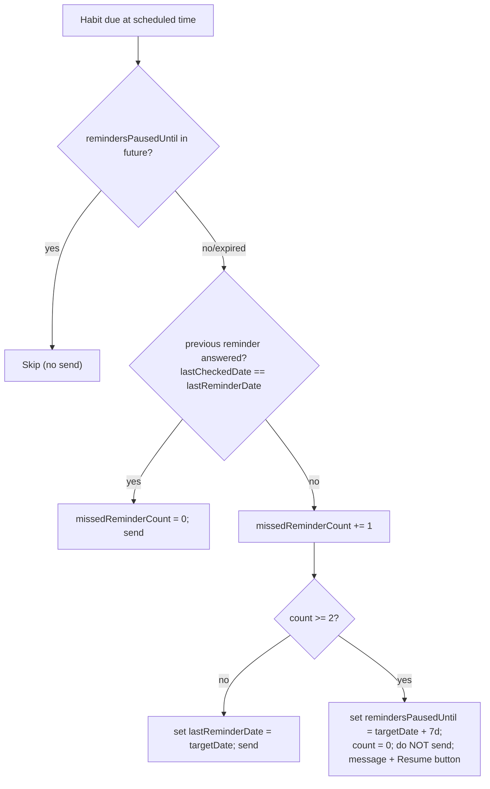

# Auto-pause reminders after 2 ignored in a row

## Behavior

- A "miss" = a scheduled reminder was sent and the user did not tap Yes/No/Skip for that reminder's `targetDate` before the next scheduled reminder.
- 2 consecutive misses → pause that habit's reminders for 7 days, send one heads-up message with a "Resume now" button, then auto-resume.
- Any Yes/No/Skip response resets the miss counter and clears any pause.
- Applies to all schedule types (daily/weekly/monthly/interval) since evaluation only happens at each scheduled occurrence.

Tie all logic to the reminder's `targetDate` (the same date stored in `callback_data` and written to `lastCheckedDate` on response), because that is the authoritative "answered day".

## 1. Data model — [`src/domain/entities/Habit.ts`](src/domain/entities/Habit.ts)

Add optional fields to `Habit` (backward compatible):
- `missedReminderCount?: number` — consecutive unanswered reminders.
- `lastReminderDate?: string` — `YYYY-MM-DD` of the last reminder actually sent.
- `remindersPausedUntil?: string` — `YYYY-MM-DD`; reminders suppressed while `targetDate < remindersPausedUntil`.

Use a separate field (not `reminderEnabled`) so auto-pause never clobbers the user's manual enable/disable.

## 2. New use case — `src/domain/use-cases/EvaluateReminderPauseUseCase.ts`

Encapsulates the pure decision + persistence so both cron paths share it. Constructor takes `IHabitRepository`. Constants from env with defaults: `REMINDER_MISS_THRESHOLD` (2), `REMINDER_PAUSE_DAYS` (7).

Method `filterDueHabits(habits: Habit[], targetDate: string): Promise<{ toSend: Habit[]; pausedNow: Habit[] }>`:
- For each habit:
  - If `remindersPausedUntil` and `targetDate < remindersPausedUntil` → skip (shouldn't normally happen since the gate also filters, but defensive).
  - Resume if expired: if `remindersPausedUntil` and `targetDate >= remindersPausedUntil` → clear pause, set `lastReminderDate = targetDate`, `missedReminderCount = 0`, persist, add to `toSend` (fresh start, no miss counting on the resume occurrence).
  - Else compute miss: `missed = lastReminderDate && lastReminderDate !== targetDate && lastCheckedDate !== lastReminderDate`.
    - If missed → `newCount = (missedReminderCount||0) + 1`; else `newCount = 0`.
    - If `newCount >= threshold` → set `remindersPausedUntil = targetDate + pauseDays`, `missedReminderCount = 0`, persist, add to `pausedNow` (do NOT send, leave `lastReminderDate` as-is).
    - Else → set `missedReminderCount = newCount`, `lastReminderDate = targetDate`, persist via `updateHabit`, add to `toSend`.
- Persistence via existing `habitRepository.updateHabit(userId, habitId, updates)`.

A small exported pure helper (e.g. `addDays(dateStr, n)`) for the date math, mirroring the `YYYY-MM-DD` style already used in [`RecordHabitCheckUseCase`](src/domain/use-cases/RecordHabitCheckUseCase.ts).

## 3. Gate — [`src/domain/use-cases/GetHabitsDueForReminderUseCase.ts`](src/domain/use-cases/GetHabitsDueForReminderUseCase.ts)

In the per-habit loop (after the `disabled` and `lastCheckedDate === today` checks, ~line 39-48), add:
- `if (habit.remindersPausedUntil && today < habit.remindersPausedUntil) continue;`

This prevents paused habits from being considered each hour. When the pause expires, the habit reappears and step 2's resume branch clears the field. (The 7-day window makes the known `today` vs cron-`targetDate` off-by-one immaterial.)

## 4. Wire into both cron paths

In [`api/reminders.ts`](api/reminders.ts) (~line 168-191) and [`src/api/reminders-server.ts`](src/api/reminders-server.ts) (~line 139-151), inside the per-user loop where `targetDate` is computed:
- Run `const { toSend, pausedNow } = await evaluateReminderPauseUseCase.filterDueHabits(habits, targetDate);`
- `await botService.sendHabitReminders(userId, toSend, targetDate);` (only the ones that pass).
- For each habit in `pausedNow`, send a one-time message via `botService.getBot().sendMessage(...)`:
  - Text like: `"You haven't responded to "<name>" reminders, so I've paused them for a week. Tap Resume to turn them back on anytime."`
  - `reply_markup` inline button `{ text: 'Resume now', callback_data: 'resume_reminders:<habitId>' }`.
  - Wrap in try/catch (user may have blocked the bot).

Both files already construct use cases and have `habitRepository`; add `new EvaluateReminderPauseUseCase(habitRepository)`.

## 5. Reset on response — [`src/domain/use-cases/RecordHabitCheckUseCase.ts`](src/domain/use-cases/RecordHabitCheckUseCase.ts)

In both `execute` (complete/drop) and `skipHabit`, when updating the habit, also set `missedReminderCount = 0` and clear `remindersPausedUntil` (any engagement re-enables reminders). These writes go through the same `saveUserHabits`/update path already used there.

## 6. "Resume now" callback — [`src/presentation/telegram/TelegramBot.ts`](src/presentation/telegram/TelegramBot.ts)

In `handleCallbackQuery` (~line 2160, next to the `open_subscribe` branch), add:
- `const resumeMatch = data.match(/^resume_reminders:(.+)$/);` → handler that clears `remindersPausedUntil` and `missedReminderCount` for that habit (via a use case/`updateHabit`), answers the callback, and edits/sends a confirmation ("Reminders resumed for <name>."). Reuse `getUserHabitsUseCase` to resolve the habit name.

## 7. Tests

- `__tests__/domain/use-cases/EvaluateReminderPauseUseCase.test.ts` (new): miss increments; reset when previous answered; pause set on 2nd consecutive miss; resume branch clears expired pause; persistence calls asserted.
- [`__tests__/domain/use-cases/RecordHabitCheckUseCase.test.ts`](__tests__/domain/use-cases/RecordHabitCheckUseCase.test.ts): assert `missedReminderCount` reset and pause cleared on complete/drop/skip.
- Add a `GetHabitsDueForReminderUseCase` test that a habit with future `remindersPausedUntil` is skipped and included once expired (if such a test file exists; otherwise minimal coverage in the new use case).

## 8. Docs — [`.cursorrules`](.cursorrules)

- Document the new `Habit` fields and the auto-pause behavior (2 consecutive ignored reminders → 7-day pause, auto-resume, Resume button, any response resets), and the new `resume_reminders:{habitId}` callback. Note env knobs `REMINDER_MISS_THRESHOLD` / `REMINDER_PAUSE_DAYS`.

## Notes / non-goals

- Manual `reminderEnabled` / `disabled` semantics unchanged; auto-pause uses a dedicated field.
- Blocked users are still skipped upstream; pause logic is independent.
- No migration needed: missing fields are treated as `0` / not paused.
