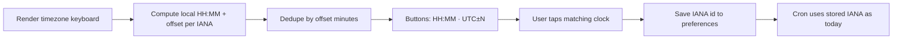

# Timezone picker: match your phone clock

## Goal

Users pick timezone by matching **current time on their phone**, not by guessing a city (Italy no longer needs “Paris”). Existing stored IANA values keep working; Settings remains the voluntary way to change.

## Locked design

- **Storage unchanged:** still save an IANA id (e.g. `Europe/Rome`) in `UserPreferences.timezone` so DST keeps working.
- **UI labels dynamic:** at render time, each button shows `HH:MM · UTC+1` (24h, zero-padded). Prompt: pick the time that matches your phone.
- **One button per current offset:** curated zones are deduped by *current* UTC offset minutes (so Paris/Rome/Berlin collapse to one row when they share the same clock).
- **Curated zone list:** replace city-emoji rows in [`src/constants/allowedTimezones.ts`](src/constants/allowedTimezones.ts) with valid IANA representatives covering integer UTC−12…+12 plus common half-hours (`Asia/Kolkata`, `Australia/Adelaide`, `America/St_Johns`). Drop invalid/obscure entries like `Pacific/Baker_Island`; use a real zone (e.g. `Etc/GMT+12` for UTC−12).
- **Backward compatible:** do **not** migrate or clear existing preferences. `Europe/Paris` etc. continue to drive reminders. Admin filter validation accepts **new UI zones ∪ legacy IDs** so old users still filter correctly.
- **Representative when user picks:** callback still stores the IANA id behind that offset row (e.g. `Europe/Rome` for CET/CEST). Fine if that differs from a legacy `Europe/Paris` user who never re-picks.

## Implementation

### 1. Constants + helpers — [`src/constants/allowedTimezones.ts`](src/constants/allowedTimezones.ts)

- Replace `TIMEZONE_OPTIONS` with a curated `TIMEZONE_REPRESENTATIVES: readonly string[]` (IANA ids only, ordered west→east).
- Export `LEGACY_TIMEZONE_IDS` = current list (so admin/validation still accept values already in Redis).
- Export `ALLOWED_TIMEZONE_IDS` = unique union of representatives + legacy (admin filter allowlist).
- Add helpers (same file or tiny sibling util):
  - `getUtcOffsetMinutes(timeZone, date)` / `formatUtcOffset(minutes)` → `UTC+1`, `UTC+5:30`
  - `formatLocalTime(timeZone, date)` → `22:15`
  - `buildTimezonePickerOptions(now = new Date())` → `{ tz, text, offsetMinutes }[]` deduped by `offsetMinutes`, label `HH:MM · UTC±N`

### 2. Bot UI — [`src/presentation/telegram/TelegramBot.ts`](src/presentation/telegram/TelegramBot.ts)

- `showTimezoneSelection` and `showTimezoneSelectionFromSettings`: call `buildTimezonePickerOptions()`, build 2-column keyboard from `text` / `tz` (same `timezone_select:` callback shape).
- Update copy to: match the time on your phone; change anytime in Settings.
- `handleTimezoneSelection`: accept any id in `ALLOWED_TIMEZONE_IDS` (union); reject unknown. Confirmation can show the live label or `tz` (e.g. `22:15 · UTC+1`).
- No forced re-onboarding; Settings path unchanged aside from new labels.

### 3. Admin filter lists

- Update hardcoded arrays in [`public/admin.html`](public/admin.html) and [`src/public/admin.html`](src/public/admin.html) to match `ALLOWED_TIMEZONE_IDS` (representatives + legacy), so filters still work for existing users.
- [`src/api/admin-users-shared.ts`](src/api/admin-users-shared.ts) already imports `ALLOWED_TIMEZONE_IDS` — no logic change once the constant is the union.

### 4. Tests

- Unit tests for `buildTimezonePickerOptions`: dedupe same offset; half-hour formatting; every returned `tz` is in representatives; legacy ids remain in `ALLOWED_TIMEZONE_IDS`.

### 5. Docs

- Short note in [`.cursorrules`](.cursorrules): timezone picker shows live clock; storage is IANA; allowlist includes legacy ids.

## Out of scope

- Migrating existing users’ stored ids to new representatives.
- Auto-detect timezone from Telegram.
- Auto-pause ignored reminders plan (separate).
